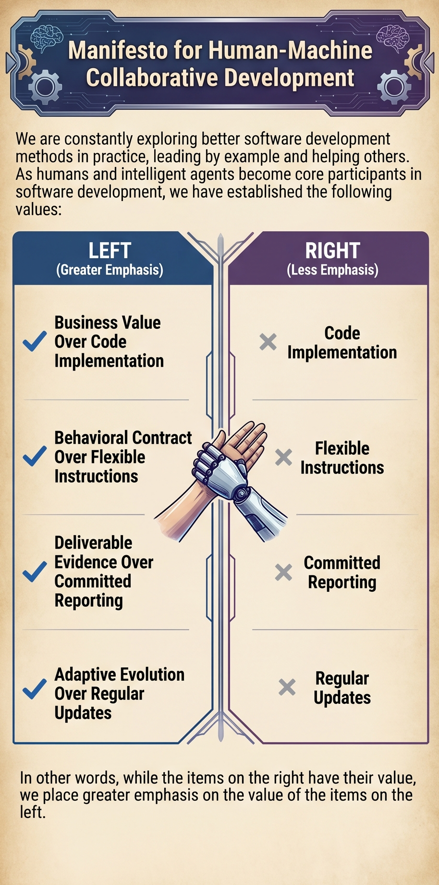
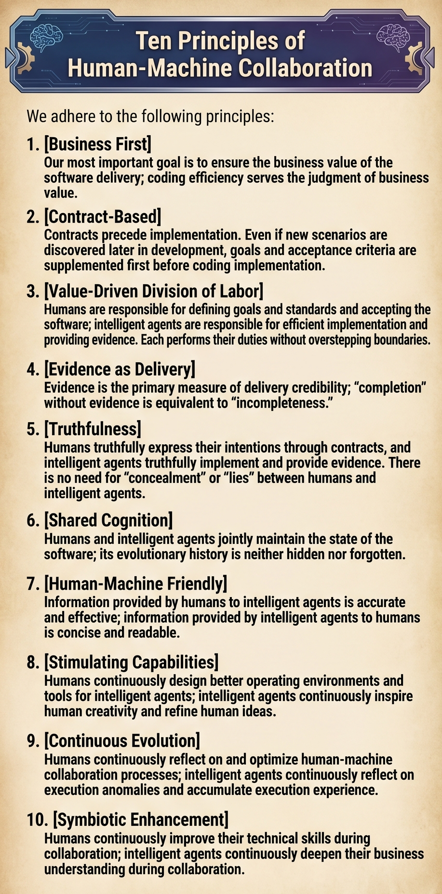

# Manifesto-for-Human-AI-Collaborative-Development
English | [中文](README.zh.md)

More than twenty years have passed since the publication of the Agile Software Development Manifesto and its twelve principles. With the rise of Code Agents, both humans and Code Agents now serve as core participants in software development. The development paradigm once centered on "human-human collaboration" has quietly shifted toward "human-machine collaboration."

We need new principles — principles that clarify the relationship between business and code, the division of responsibilities between humans and Code Agents, how both parties participate in project evolution, and how to collaborate efficiently and grow together. Thus we propose the **Human-AI Collaborative Development Manifesto** and the **Ten Principles of Human-AI Collaboration**, in the hope of practicing this new development paradigm together.

## Manifesto for Human-AI Collaborative Development

We are continually exploring better ways of developing software, practicing them ourselves, and helping others do the same.

As humans and intelligent agents together become core participants in software development, we have come to value:

**Business Value over Code Implementation**

**Behavioral Contracts over Ad Hoc Instructions**

**Delivery Evidence over Status Reports**

**Continuous Evolution over Scheduled Updates**

That is, while there is value in the items on the right, we value the items on the left more.



## Ten Principles of Human-AI Collaboration

We follow these principles:

1. [Business First] Our highest priority is to ensure the business value of software delivery. Coding efficiency serves business value judgment.

2. [Contracts as the Foundation] Contracts precede implementation. Even when new scenarios are discovered late in development, goals and acceptance criteria are defined first, before coding begins.

3. [Value-Driven Division of Labor] Humans define goals and standards, and validate software; intelligent agents implement efficiently and provide evidence. Each fulfills its own role without overstepping.

4. [Evidence as Delivery] Evidence is the primary measure of delivery credibility. "Done" without evidence is equivalent to "not done."

5. [Truthfulness] Humans express their intent truthfully through contracts; intelligent agents implement truthfully and provide evidence. There is no need for "embellishment" or "concealment" between humans and intelligent agents.

6. [Shared Understanding] Humans and intelligent agents jointly maintain the state of the software. Evolution history is neither hidden nor forgotten.

7. [Human-AI Friendly] Information from humans to intelligent agents is precise and effective; information from intelligent agents to humans is concise and readable.

8. [Capability Stimulation] Humans continually design better environments and tools for intelligent agents; intelligent agents continually inspire human creativity and refine human ideas.

9. [Continuous Evolution] Humans continually reflect on and optimize human-AI collaboration processes; intelligent agents continually reflect on execution anomalies and accumulate execution experience.

10. [Symbiotic Enhancement] Humans continuously improve their technical skills through collaboration; intelligent agents continuously deepen their business understanding through collaboration.



## Practical Examples

The `skills` folder in this project contains several skills that demonstrate how to translate the values and ten principles of the *Human-AI Collaborative Development Manifesto* into executable workflows.

> Note: You can add details on top of them to better fit your project.

| Skill | Trigger | Core Responsibility | Deliverable |
|-------|---------|---------------------|-------------|
| **project-analyze** | When encountering a new project, or when the project structure undergoes significant changes | Deep analysis of the engineering, extracting architecture, tech stack, and business semantics | `PROJECT_STATE/` directory and documentation set |
| **bdd-atdd** | When the user requests a feature implementation, bug fix, or code refactoring | First define behavioral contracts, then implement code, then self-verify and deliver evidence | Contracts and acceptance documents under `PROJECT_STATE/BDD/` and `PROJECT_STATE/ATDD/` |
| **doc-update** | After completing code changes | Update project documentation based on changes, recording evolution status and lessons learned | Updates to `PROJECT_STATE/index.md`, `README.md`, `LEARNING/`, etc. |

The collaborative relationship among the three:

```
project-analyze (Cognitive Foundation)
        ↓ produces PROJECT_STATE
   bdd-atdd (Acceptance Driven Development)
        ↓ produces BDD + ATDD documents + code
   doc-update (Evolution Sync)
        ↓ updates PROJECT_STATE / LEARNING
   (return to bdd-atdd to start the next iteration)
```

---

## Value Mapping

### 1. Business Value over Coding Implementation

In traditional agile, "working software" is the primary measure. But in human-AI collaboration, agents produce code far faster than humans can review. "It runs" does not equal "it has business value." The three skills ensure business value is not drowned out by coding efficiency in the following ways:

- **project-analyze** executes "business semantics mapping" in Phase 2 — for each module, it must answer "what it does," inferring business functions from naming, type definitions, and API routes, rather than merely listing technical components. If business semantics cannot be inferred from code, it marks them as "to be confirmed" instead of guessing. This ensures the agent's understanding of the project is always anchored at the business level.
- **bdd-atdd** requires analyzing requirements and clarifying scope before deriving feature names and writing behavioral specifications in Phase 1. Coding (Phase 3) must not begin until behavioral specifications have been confirmed by the user. This structurally prevents the tendency to "write code first, think about requirements later."
- **doc-update** emphasizes only focusing on "user-visible functionality" when updating `README.md`. Internal code refactoring that does not affect how users interact with the software should not trigger updates, avoiding information noise.

### 2. Behavioral Contracts over Flexible Instructions

In traditional agile, "individuals and interactions" emphasizes human-to-human communication. But in human-AI collaboration, communication between humans and agents has a natural asymmetry — human natural-language intent must be precisely translated into structured descriptions executable by the agent. Free-form instructions easily lead to misunderstandings, whereas behavioral contracts (BDD's Given/When/Then format) provide a shared language that both parties can understand unambiguously.

- The core of **bdd-atdd** is the concrete implementation of "behavioral contracts":
  - **Phase 1 (BDD Specification)**: Translates the user's natural-language requirements into behavioral scenarios in Given/When/Then format, covering happy paths, edge cases, and error conditions. This process itself is one of "clarifying intent" — writing Given/When/Then forces both parties (human and agent) to make vague requirements concrete.
  - **Phase 2 (ATDD Draft)**: Based on BDD scenarios, further defines acceptance criteria, specifying "what command to verify with, what result is expected." The ATDD draft is submitted for user review, ensuring human and agent agree on "what counts as done."
  - **Phase 3 (Implementation)**: The agent codes strictly according to the confirmed behavioral contracts. If new scenarios are discovered during implementation, **direct coding is not allowed** — the agent must return to Phase 1 to add the new scenarios to the BDD document first. Contracts precede implementation.
- A key guideline in the BDD template states: "Write scenarios from the user's perspective — describe behavior, not implementation details." This ensures the contract describes "what to do" rather than "how to do it," leaving implementation freedom to the agent and intent control to the human.

### 3. Delivery Evidence over Promises and Reports

In traditional agile, "customer collaboration" emphasizes ongoing cooperation with customers rather than contract negotiation. In human-AI collaboration, the agent is an efficient but verifiable executor. Humans cannot and should not review every line of the agent's output, but nor should they blindly trust it. Therefore, "evidence" becomes the bridge for building trust — the agent does not need to promise "I'm done," but rather provides auditable evidence proving "I'm done."

- **Phase 4 (Self-Verification)** and **Phase 5 (ATDD Finalization)** of **bdd-atdd** form a complete evidence chain:
  - **Self-verification decision tree**: Run existing tests → Write targeted tests → Code path tracing → Mark as "unable to verify." This is a **tiered de-escalation but always honest** strategy.
  - **Diverse evidence forms**: Test output, log snippets, screenshots, and data files can all serve as evidence, stored in the `PROJECT_STATE/ATDD/<feature-name>/` directory.
  - **ATDD Finalization**: Fills the actual self-verification results into the acceptance document, including the results and evidence for each test case. The summary table clearly shows scenario coverage.
  - Key rule: **No scenario may be skipped, nor may any scenario be marked as passed without evidence.**
- The evolution timeline maintained by **doc-update** in `PROJECT_STATE/index.md` is itself project-level delivery evidence — recording the time, type, and content of every change.

### 4. Adaptive Evolution over Periodic Updates

In traditional agile, "responding to change" refers to a team's flexibility in handling requirement changes. In human-AI collaboration, "evolution" has a deeper meaning — agents may lose context between sessions, and project state can become fragmented across different sessions. Therefore, a mechanism is needed so that project understanding can evolve in sync with code, rather than relying on periodic manual review.

- The design of **doc-update** directly embodies this value:
  - It triggers **after every code change**, not on a fixed schedule.
  - The decision matrix precisely determines which documents need updating based on the type of change (new feature, architecture adjustment, bug fix, etc.), avoiding both over-updating and under-updating.
  - The evolution timeline records entries at `yyyy-mm-dd-hh-mm` precision by default. When entries exceed 20, they are automatically summarized into `yyyy-mm` format, balancing detail with readability.
- **project-analyze** can be re-run when the project structure undergoes significant changes, updating `PROJECT_STATE` to reflect the latest state.
- **bdd-atdd** allows returning to the BDD phase to supplement contracts when new scenarios are discovered during implementation, rather than forcing new requirements into the existing implementation — this is itself an adaptation to change.

---

## Ten Principles Mapping

### Principle 1: [Business First]

> Our highest priority is to ensure the business value delivered by software. Coding efficiency serves business value judgment.

**Implementation**:
- **project-analyze** not only extracts tech stack and architecture when analyzing a project, but also enforces "business semantics mapping" — answering for each module "what it is, what it does, what it depends on, what depends on it." If this cannot be inferred, it is marked as "to be confirmed."
- **bdd-atdd** requires analyzing requirements and clarifying scope in Phase 1. If the user's request is not clear enough, the agent must proactively ask questions to understand inputs, outputs, edge cases, and error cases, rather than diving straight into coding.
- This ensures the agent's coding efficiency always serves the human's judgment of business value, rather than being blindly efficient disconnected from business context.

### Principle 2: [Contracts as the Foundation]

> Contracts precede implementation. Even when new scenarios are discovered later in development, targets and acceptance criteria must be supplemented first, before coding begins.

**Implementation**:
- **bdd-atdd**'s five-phase process executes in strict sequence. Phase 1 (BDD Specification) and Phase 2 (ATDD Draft) must be completed before Phase 3 (Coding).
- Phase 3 has a hard rule: **if new scenarios are discovered during implementation, the agent must return to Phase 1**, add the new scenarios to the BDD document first, synchronously update the ATDD draft, then continue implementation.
- BDD documents use Given/When/Then format — a formal contract that is machine-parseable and human-reviewable. The ATDD draft further transforms the contract into executable acceptance criteria.

### Principle 3: [Value-Driven Division of Labor]

> Humans are responsible for defining goals and standards, and accepting software. Agents are responsible for efficient implementation and providing evidence. Each fulfills its own role without overstepping.

**Implementation**:
- **bdd-atdd**'s workflow naturally implements this division of labor:
  - **Human**: Reviews and confirms BDD documents (Phase 1), reviews and confirms ATDD drafts (Phase 2), and performs final acceptance of the software.
  - **Agent**: Drafts BDD documents, writes ATDD drafts, codes the implementation (Phase 3), performs self-verification (Phase 4), and finalizes the ATDD document (Phase 5).
- At the end of each phase, there is a clear "submit for user review" checkpoint, ensuring the human does not miss key decision points and the agent does not overstep its authority to independently decide behavioral definitions or acceptance criteria.
- In **project-analyze**, the module partitioning plan must be confirmed by the user — the agent provides analysis results and multiple classification options, and the human makes the final decision.

### Principle 4: [Evidence as Delivery]

> Evidence is the primary measure of delivery credibility. "Done" without evidence is equivalent to "not done."

**Implementation**:
- **bdd-atdd**'s self-verification phase (Phase 4) verifies each BDD scenario individually, recording pass/fail status and evidence. The verification strategy follows priority: run existing tests > write new tests > code path tracing > mark as "unable to verify."
- The verification guide has an inviolable bottom line: **no scenario may be skipped, nor may any scenario be marked as passed without evidence.**
- ATDD finalization (Phase 5) structurally fills verification results into the document, including a summary table, making evidence traceable and auditable.

### Principle 5: [Truthfulness]

> Humans express their intent truthfully through contracts. Agents implement truthfully and provide evidence. There is no need for "embellishment" or "concealment" between humans and intelligent agents.

**Implementation**:
- Multiple stages of **bdd-atdd** embody truthfulness:
  - In self-verification, if a scenario cannot be verified through automated testing, the verification guide requires honestly explaining what was checked, rather than pretending it passed.
  - ATDD finalization requires "honest and complete" reporting. If a scenario truly cannot be verified, this should be stated as-is.
  - When verification fails, the requirement is to record the failure, investigate the cause, fix the code, and re-verify — not to simply skip it.
- In **project-analyze**, if business semantics cannot be inferred from code, the requirement is to mark it as "to be confirmed" rather than guessing. A key design decision states: "Do not fabricate decision rationale that cannot be verified from code."
- In **doc-update**, `LEARNING/index.md` is used to record execution anomalies, user corrections, and lessons learned from pitfalls — this is honest recording of failures and issues, not just showcasing successes.

### Principle 6: [Shared Understanding]

> Humans and agents jointly maintain the state of the software. Evolution history is not hidden, not forgotten.

**Implementation**:
- The `PROJECT_STATE/` directory produced by **project-analyze** is the carrier of human-AI shared understanding. It includes:
  - `index.md`: Project overview
  - `architecture.md`: Architecture and tech stack design
  - `modules/*.md`: Details of each business module
- **bdd-atdd** creates `BDD/` and `ATDD/` subdirectories under `PROJECT_STATE/`, bringing behavioral contracts and acceptance evidence into the shared understanding system.
- **doc-update** continuously updates `PROJECT_STATE/index.md` through the evolution timeline, ensuring project state changes are fully recorded. The timeline automatically summarizes entries when there are too many, balancing information completeness with readability.
- The core value of this mechanism: **even if the agent loses context in a new session, it can quickly restore its understanding of the project by reading `PROJECT_STATE/`.**

### Principle 7: [Human-AI Friendly]

> Information provided by humans to agents is precise and effective; information provided by agents to humans is concise and readable.

**Implementation**:
- **Human → Agent** (precise and effective):
  - BDD's Given/When/Then format forces humans to make vague requirements concrete into verifiable scenarios. The template guide requires "be specific and clear in Then clauses — avoid vague assertions like 'it works correctly.'"
  - ATDD drafts require specifying "what command to use, what result is expected," further concretizing acceptance criteria.
- **Agent → Human** (concise and readable):
  - BDD documents use a unified scenario format that is clear at a glance.
  - ATDD finalization includes a summary table presenting scenario coverage and verification results in tabular form.
  - The architecture blueprint and business module descriptions in `PROJECT_STATE/index.md` are both limited to "no more than ten lines," ensuring high information density and low reading burden.
  - `LEARNING/index.md` contains only one-sentence summaries, with details split into separate files for on-demand reading.

### Principle 8: [Capability Stimulation]

> Humans continuously design better operating environments and tools for agents. Agents continuously inspire human creativity and refine human ideas.

**Implementation**:
- **Human → Agent**: The three skills themselves are the structured operating environments designed by humans for agents. BDD templates, ATDD templates, and verification guides provide agents with a clear action framework, so they do not need to guess "what to do next." `PROJECT_STATE/` provides agents with project context, enabling them to quickly get up to speed in any session.
- **Agent → Human**:
  - **project-analyze** may reveal architectural issues or inter-module dependencies that humans have not noticed during analysis, inspiring humans to rethink the project.
  - **bdd-atdd**, when writing BDD scenarios in Phase 1, the agent proactively considers edge cases and error conditions that humans may not have thought of when stating requirements, thereby helping humans refine and improve their requirements.

### Principle 9: [Continuous Evolution]

> Humans continuously reflect on and optimize human-AI collaboration processes. Agents continuously learn from execution anomalies and accumulate execution experience.

**Implementation**:
- The `LEARNING/` directory maintained by **doc-update** is the direct implementation of this principle:
  - **Execution anomalies and resolutions**: Records build failures, dependency conflicts, runtime errors, and their solutions. This experience can be retrieved and referenced by the agent in subsequent sessions, avoiding repeated pitfalls.
  - **Corrections from users**: Records user corrections and improvement suggestions regarding the agent's working methods. This feedback helps the agent adjust its behavior in subsequent work.
  - Each lesson has a one-sentence summary in `LEARNING/index.md`, with details split into separate files, forming a searchable experience repository.
- **project-analyze** can be re-run when the project structure undergoes significant changes, updating `PROJECT_STATE` to reflect the latest state, rather than relying on a one-time initial analysis.

### Principle 10: [Symbiotic Enhancement]

> Humans continuously improve their technical skills during collaboration. Agents continuously deepen their business understanding during collaboration.

**Implementation**:
- **Humans improve technical skills**: By reviewing BDD/ATDD documents produced by the agent, reading the architectural analysis in `PROJECT_STATE/architecture.md`, humans gain a deeper understanding of the project's technical architecture and design decisions. Technical constraints and lessons learned recorded in `LEARNING/` also contribute to human technical growth.
- **Agents deepen business understanding**:
  - **project-analyze**'s "business semantics mapping" enables the agent to reverse-engineer business logic from source code, rather than only understanding the technical layer.
  - **bdd-atdd**'s BDD writing process requires the agent to think about scenarios from the user's perspective, which itself deepens business understanding.
  - `PROJECT_STATE/` serves as persisted project understanding, enabling the agent to carry forward historical business understanding into each new session, rather than starting from scratch.

---

## Full Collaboration Workflow Overview

Below is a typical human-AI collaborative development cycle, showing how the three skills work together:

```
┌──────────────────────────────────────────────────────┐
│ 1. First Contact with Project                        │
│    Trigger project-analyze                           │
│    Human confirms module partitioning plan           │
│    Produces PROJECT_STATE/                           │
└──────────────────────┬───────────────────────────────┘
                       ↓
┌──────────────────────────────────────────────────────┐
│ 2. User Submits Feature Request                      │
│    Trigger bdd-atdd                                  │
│    ├─ Phase 1: Agent writes BDD, human reviews       │
│    ├─ Phase 2: Agent writes ATDD draft, human reviews│
│    ├─ Phase 3: Agent codes implementation            │
│    ├─ Phase 4: Agent self-verifies, records evidence │
│    └─ Phase 5: Agent finalizes ATDD document         │
└──────────────────────┬───────────────────────────────┘
                       ↓
┌──────────────────────────────────────────────────────┐
│ 3. Code Changes Complete                             │
│    Trigger doc-update                                │
│    Determine change type from git diff               │
│    Update PROJECT_STATE / README / LEARNING per      │
│    decision matrix                                   │
└──────────────────────┬───────────────────────────────┘
                       ↓
      Return to Step 2 for the next request
```

In this cycle:
- **Human** participation is concentrated at **decision points**: confirming module partitioning, reviewing BDD, reviewing ATDD drafts. The rest of the time, the agent executes autonomously.
- **Agent** execution is always constrained by **behavioral contracts**, and proves execution quality through **evidence**.
- **PROJECT_STATE** serves as the bond of shared understanding, ensuring cross-session context continuity.
